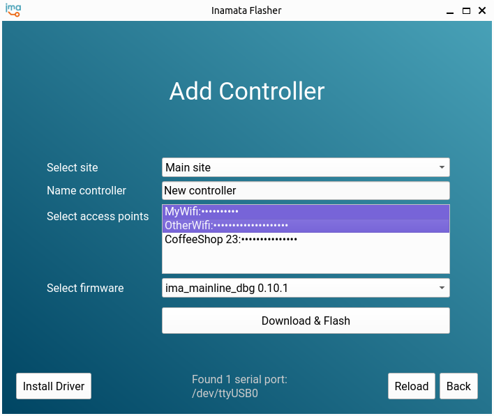
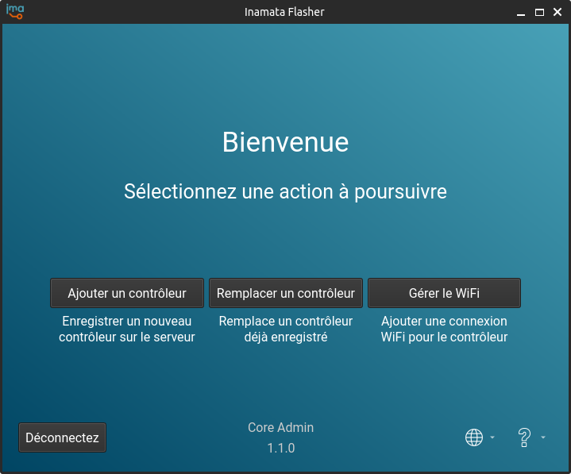

[][10]

# Inamata Flasher

Flash the firmware onto an ESP32 and register it with the server. Released for the [Inamata IoT platform][10].

[Screenshots](#screenshots) | [Languages](#languages) | [Driver Setup](#driver-setup-instructions) | [Development](doc/development.md) | [Known Issues](doc/known_issues.md)

## Download

[][11]
[](https://snapcraft.io/inamata-flasher)

### Windows

For Windows download the [latest setup installer][11].

- Start (double-click) the downloaded file
- Click `More info`
- Click `Run anyway`

Alternatively, download the [latest standalone executable][8] from GitHub releases.

### Linux

For Linux use the [Snap download][9] to receive automatic updates. After installing it, run the [snap setup instructions](#snap-setup-instructions).

- In a terminal run
  - sudo usermod -a -G dialout $USER
  - sudo snap connect inamata-flasher:raw-usb
  - sudo snap connect inamata-flasher:password-manager-service
- Logout and back in again

Alternatively, download the [latest standalone executable][8] from GitHub releases.

- In a terminal run
  - chmod +x <path-to-file>
  - sudo usermod -a -G dialout $USER
- Start (double-click) the downloaded file

The app is available via the following packages:

|              | GitHub Release | Snap Store | Installer  | Source |
| ------------ | -------------- | ---------- | ---------- | ------ |
| **Linux**    | Yes            | Yes        | No         | Yes    |
| **Windows**  | Yes            | No         | Yes        | Yes    |
| **Packager** | PyInstaller    | Snap       | Inno Setup | None   |

## Screenshots

| Windows Screenshots                                 | Linux Screenshots                                      |
| --------------------------------------------------- | ------------------------------------------------------ |
|  |  |
| Welcome page for Windows 10 → [more pages][1]       | Add controller page for Ubuntu 22.04 → [more pages][2] |

## Languages

The application is available in English 🇺🇸, German 🇩🇪 and French 🇫🇷 with Spanish 🇪🇸 and Chinese 🇨🇳 in the pipeline.

The translations have been created with the help of translation software as well as a mixture of native and non-native speakers. If you find any translation errors, we'll gladly accept merge requests or an e-mail with the mistranslated strings. Instructions for translators are available in the [development doc](doc/development.md#Internationalization).

| German                                                                  | French                                                                  |
| ----------------------------------------------------------------------- | ----------------------------------------------------------------------- |
|  |  |

## Snap Setup Instructions

Snap isolates apps so it requires explicit permission to access USB devices to flash microcontrollers as well as optionally saving the authentication token. Run the following commands in a terminal:

```
snap connect inamata-flasher:raw-usb
```

Optionally, to enable saving the authentication token between restarts:

```
snap connect inamata-flasher:password-manager-service
```

## Driver Setup Instructions

### Windows

Download and install the [CP210x USB to UART Bridge driver][4] for [silabs.com][3].

### Linux

Open a terminal, run the following code, **logout** and then back in again for the changes to take effect.

    sudo usermod -a -G dialout $USER

## Future Features

This is a list of features that would be useful and show the tool's current limitations

- Handling of more than 100 site, firmware images or controller instances
  - This is due to not handling paging of the GraphQL requests
- Delete controller when creating a new on and an error occurs after registration
- Enable searching of combo boxes with many items
  - This is described on [StackOverflow](https://stackoverflow.com/questions/4827207/how-do-i-filter-the-pyqt-qcombobox-items-based-on-the-text-input)
- Use PlatformIO as an flash/upload tool?: https://community.platformio.org/t/upload-latest-build-without-a-compile-link/9520

[1]: screenshots/windows.md
[2]: screenshots/linux.md
[3]: https://www.silabs.com/developers/usb-to-uart-bridge-vcp-drivers
[4]: https://www.silabs.com/documents/public/software/CP210x_Windows_Drivers.zip
[6]: https://github.com/espressif/arduino-esp32/blob/master/libraries/LittleFS/library.properties
[7]: https://pypi.org/project/littlefs-python/
[8]: https://github.com/InamataCo/Flasher/releases/latest
[9]: https://snapcraft.io/inamata-flasher
[10]: https://inamata.co
[11]: https://github.com/InamataCo/Flasher/releases/latest/download/inamata_flasher_setup.exe
